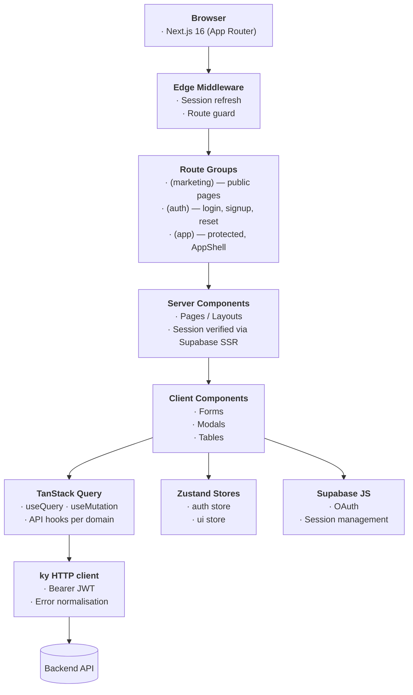

# frontend-core

Next.js 16 SaaS frontend template — authentication, multi-tenant orgs, Stripe billing, feature flags, API keys, and audit logging. Designed to be cloned and extended with a product-specific layer.

---

## Tech Stack

| Concern | Library |
|---|---|
| Framework | Next.js 16 (App Router) |
| Styling | Tailwind CSS v4 + CSS tokens |
| Components | shadcn/ui |
| Server state | TanStack Query |
| Client state | Zustand |
| HTTP client | ky |
| Auth | Supabase JS (JWT, OAuth, SSR cookies) |
| Notifications | Sonner |

---

## Architecture



---

## Getting Started

**Prerequisites:** Node.js 20+, a Supabase project, a running `backend-core` instance.

```bash
cp .env.example .env.local
# Fill in NEXT_PUBLIC_SUPABASE_URL, NEXT_PUBLIC_SUPABASE_ANON_KEY,
# NEXT_PUBLIC_API_URL

npm install
npm run dev
```

App runs at `http://localhost:3000`.

---

## Running Tests

```bash
# Unit tests (vitest)
npm run test

# E2E tests (Playwright)
npx playwright test
```

For authenticated E2E tests, set `TEST_USER_EMAIL` and `TEST_USER_PASSWORD` in `.env.local`. Tests are skipped automatically if credentials are absent.

---

## Key Conventions

- All colours, spacing, and radius are CSS tokens in `src/styles/tokens.css`. No inline `style` props anywhere.
- `components/ui/` is shadcn-managed — never modify those files directly. Extend via wrapper components in `components/shared/`.
- All data fetching goes through TanStack Query hooks in `src/lib/api/`. No `useEffect + fetch` patterns.
- Zustand stores (`src/stores/`) own UI state (sidebar, modals, theme). No React context for UI state.
- All API errors are normalised to `{ error: { code, message, detail } }` in `src/lib/api/client.ts` before reaching any hook.

---

## Folder Structure

```
src/
  app/              # Next.js App Router pages and layouts
    (app)/          # Authenticated routes — session-guarded
    (auth)/         # Login, signup, reset password
    (marketing)/    # Public pages
  components/
    auth/           # Auth forms
    billing/        # Plans, pricing cards, cancel modal
    layout/         # AppShell, Sidebar, Header, UserMenu
    org/            # Member list, invite, role dialogs
    shared/         # DataTable, ThemeToggle, guards/, FeedbackStates/, LoadingStates/, SettingsModal/
    ui/             # shadcn primitives (do not edit)
  lib/
    api/            # TanStack Query hooks, one file per domain
    auth/           # Supabase client/server helpers, HydrateAuthStore
  stores/           # Zustand: auth.ts, ui.ts
  types/            # TypeScript interfaces matching backend schemas
  styles/           # tokens.css (design tokens), globals.css
```

---

## Used Together

This repo is the frontend half of a two-repo SaaS template. The backend counterpart is [backend-core](https://github.com/siddarthanath/backend-core) — a FastAPI service that this app calls for all data operations. Both repos are designed to be cloned together and extended with a product-specific layer.
